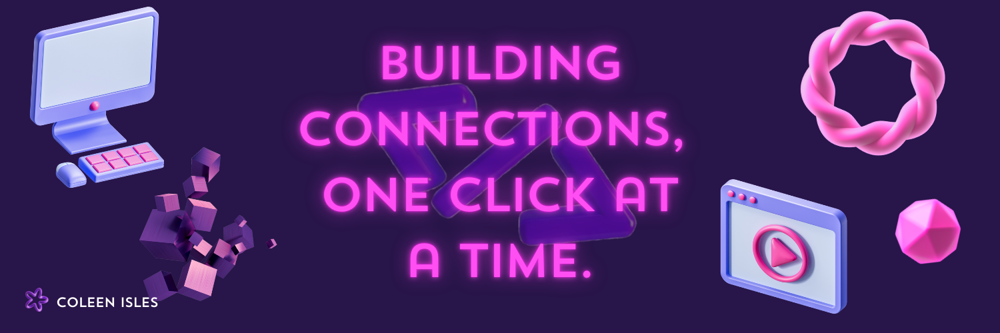

  

    

<!--- Social Links -->

    &nbsp;&nbsp;
    &nbsp;&nbsp;
    &nbsp;&nbsp;
    

## 💻 Hey, I'm Coleen Isles — I Break the Internet (But Like… in a Cute Way)

**Frontend Dev | UI Maximalist | Button-Overthinker | Probably Adding Drop Shadows Somewhere | Proud PUP Student**

### ✨ About Me

I professionally make websites *prettier*, *sassier*, and spend way too much time in Inspect Mode making sure everything is pixel-perfect.

You'll usually find me:
- ☕ Cramming projects with questionable amounts of coffee
- 🎨 Overthinking every pixel, font size, and shadow
- ✨ Turning normal buttons into sparkly, hoverable dopamine traps
- 📱 Whispering sweet nothings to my media queries

> *"It's not a bug, it's an aesthetic challenge."*

 

## 🛠️ My Code Arsenal

**Programming & Technical Foundation**

  
  
  
  

**Quality Assurance & Testing**

  
  
  
  

**Project Management & Collaboration**

  
  
  
  
  
  

**Tools & Frameworks:**

    
  
  
  

**Bonus Abilities:**
- ✔ Obsessing over tiny alignment issues
- ✔ Fixing little design things no one notices… but I do
- ✔ Smashing `Ctrl + S` every 3 seconds for peace of mind

## 📊 GitHub Stats
<table align="center">
  <tr>
    <td>
     
    </td>
    <td>
      
    </td>
  </tr>
</table>

## 📌 Featured Projects

    
    

    

    

## 🎯 Life Goals

- 💜 Make the internet 75% cuter — preferably with lots of purple
- ✨ Add hover states *just because*
- 📱 Master the sacred art of *"Looks good on mobile AND desktop"*
- 🚀 Keep breaking stuff until it's pretty *and* functional

### 💬 Random Dev Quote

    

## 🐍 Contribution Snake

  

    

    

