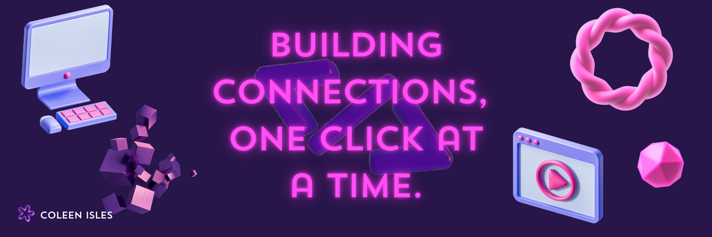

  

    

<!--- Social Links -->

    &nbsp;&nbsp;
    &nbsp;&nbsp;
    &nbsp;&nbsp;
    

## 💻 Hey, I'm Coleen Isles — I Break the Internet (But Like… in a Cute Way)

**Frontend Dev | UI Maximalist | Button-Overthinker | Probably Adding Drop Shadows Somewhere | Proud PUP Student**

### ✨ About Me

I professionally make websites *prettier*, *sassier*, and spend way too much   time in Inspect Mode making sure everything is pixel-perfect.

You'll usually find me:
- ☕ Cramming projects with questionable amounts of coffee
- 🎨 Overthinking every pixel, font size, and shadow
- ✨ Turning normal buttons into sparkly, hoverable dopamine traps
- 📱 Whispering sweet nothings to my media queries

> *"It's not a bug, it's an aesthetic challenge."*

## 🔧 Tech Stack

| Category | Skills |
|----------|--------|
| **Programming** |     |
| **QA & Testing** |     |
| **Project Management** |      |
| **Tools** |     |

## 📊 GitHub Stats

  
  

## 📌 Featured Projects

  
  
  
  

  

## 🐍 Contribution Snake

  <picture>
    <source media="(prefers-color-scheme: dark)"
      srcset="https://raw.githubusercontent.com/colelezzz/colelezzz/output/github-contribution-grid-snake-dark.svg" />
    
  </picture>

  

&nbsp;

    

